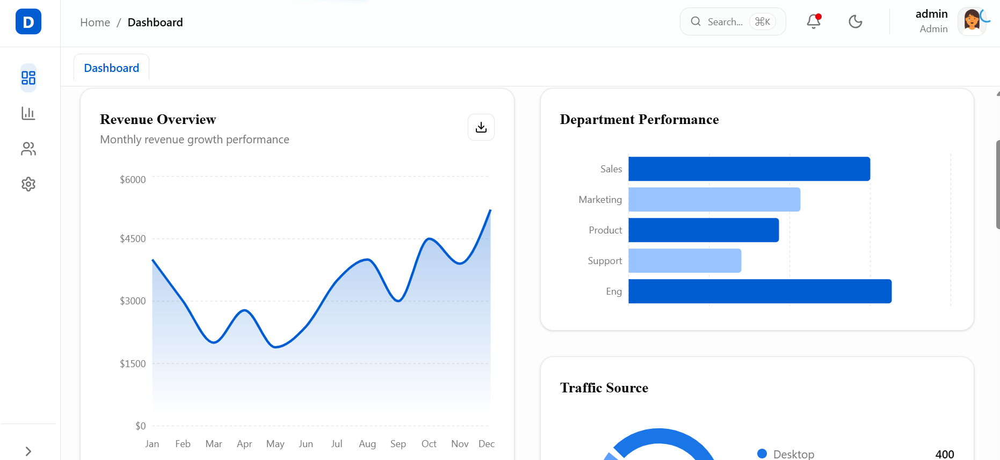
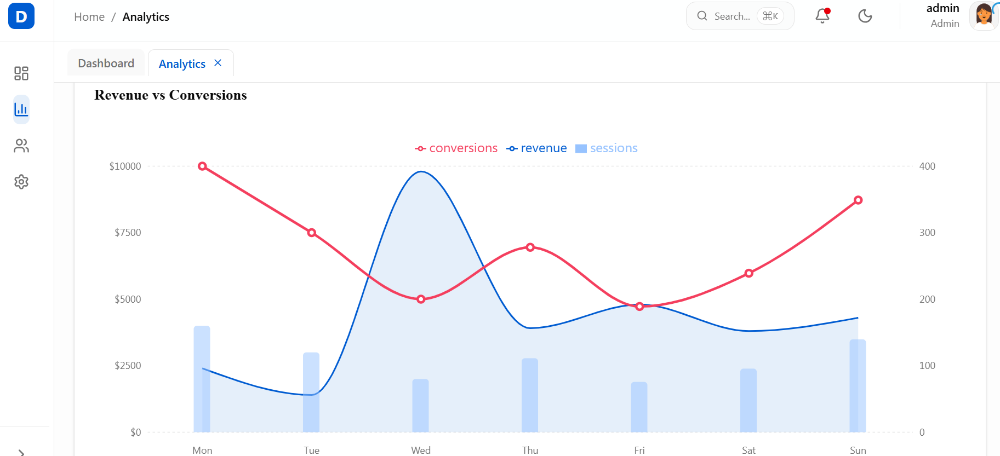
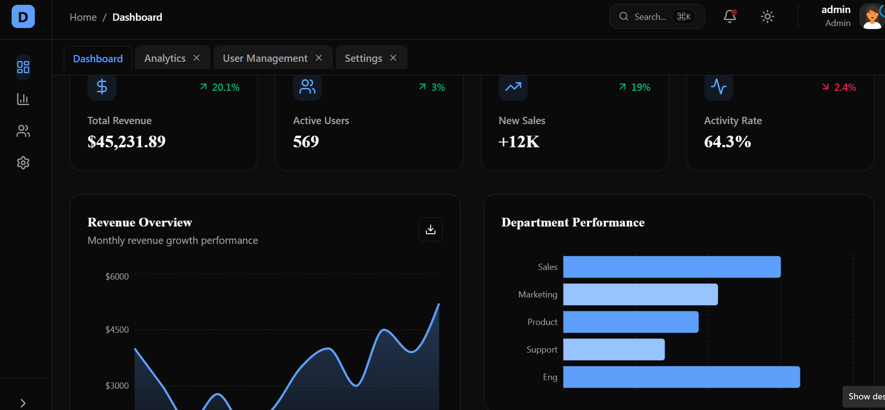

# DashHub - Premium Production-Ready React Dashboard

A highly sophisticated, full-featured dashboard application built with **React 19**, **TypeScript**, and **Tailwind CSS 4**. This project demonstrates advanced engineering patterns, including role-based authentication, real-time data simulation, complex data visualization, and a multi-tab navigation system.

##🖼️ Preview
<p align="center">
  
</p>

<p align="center">
  
  
</p>

## 🚀 Key Features

- **Authentication & Security**:
  - Mock JWT authentication with persistent state.
  - Role-based access control (Admin vs. Viewer).
  - Protected routes and login validation (React Hook Form + Zod).
- **Advanced Navigation**:
  - Collapsible nested sidebar.
  - Browser-like multi-tab system.
  - Command Palette (Ctrl+K) for quick actions.
  - Syncronized breadcrumbs.
- **Data Visualization**:
  - Real-time KPI metrics via WebSocket mock.
  - Interactive charts (Area, Bar, Pie with drill-down) using Recharts.
  - Custom sparklines and animated counters.
- **High-Performance Data Tables**:
  - TanStack Table v8 integration.
  - Client/Server-side pagination, sorting, and filtering.
  - Column visibility toggle and row selection.
- **Premium UX/UI**:
  - Tailwind CSS 4 with OKLCH color space for vibrant themes.
  - Dark/Light mode with system preference detection.
  - Smooth micro-interactions and page transitions (Framer Motion).
  - Toast notifications (Sonner) and Skeleton loaders.
  - **CV Mode**: Toggleable mode that highlights technical implementation details for portfolio showcases.

## 🛠️ Tech Stack

- **Framework**: React 19 + Vite
- **Language**: TypeScript (Strict Mode)
- **Styling**: Tailwind CSS 4 + PostCSS
- **State Management**: Zustand (Global UI), TanStack Query (Server State)
- **Routing**: React Router 7
- **Forms**: React Hook Form + Zod
- **Charts**: Recharts
- **Tables**: TanStack Table
- **Animations**: Framer Motion
- **Icons**: Lucide React
- **Testing**: Jest + React Testing Library

## 📦 Project Structure

```
src/
├── api/          # Axios client & Mock interceptors
├── components/   # Common reusable UI components
├── features/     # Feature-based modules (Auth, Dashboard, etc.)
├── hooks/        # Custom reusable hooks
├── layouts/      # Main application layouts
├── lib/          # Utilities and theme configuration
├── store/        # Global Zustand stores
└── types/        # Global TypeScript interfaces
```

## 🛠️ Getting Started

### Prerequisites
- Node.js 18.x or higher
- npm or yarn

### Installation
1. Clone the repository:
   ```bash
   git clone <repository-url>
   cd Business_Dashboard
   ```
2. Install dependencies:
   ```bash
   npm install
   ```
3. Run the development server:
   ```bash
   npm run dev
   ```

### Running Tests
```bash
npm test
```

## 👨‍💻 Author

**Shameer Ali**  
Frontend / MERN Developer  

- 🌐 GitHub: https://github.com/shameer125  
- 💼 LinkedIn: https://linkedin.com/in/shameer-ali-8420a6322
- 📧 Email: alishameer251@gmail.com 

## 💡 Keyboard Shortcuts
- `Ctrl + K`: Open Command Palette
- `Ctrl + D`: Toggle Dark Mode

## 📄 License
This project is for portfolio demonstration purposes. Feel free to use the patterns for your own applications.
